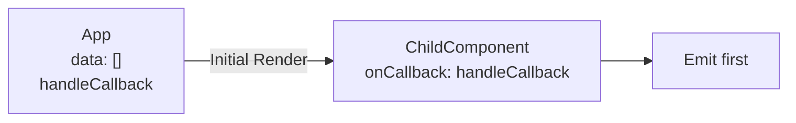
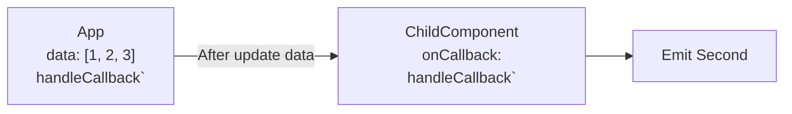
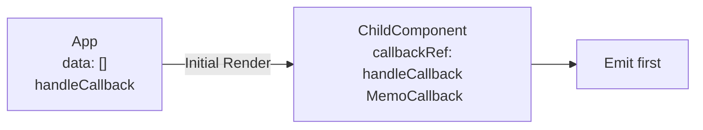
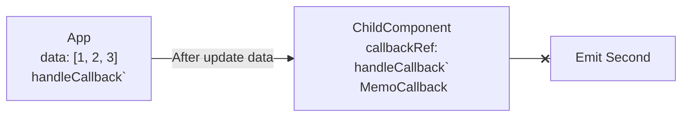

import { Playground } from '@site/src/components/playground/index.tsx'
import { basicProblemSnippet, basicProblemSolveSnippet, listProblemSnippet, useCallbackRefSnippet, edgeCaseSnippet } from '@site/src/code-snippet/useCallbackRef/index.js'

React를 사용하다 보면 function을 component props로 넘길 때 re-render를 피하기 위해 reference 관리에 주의해야 한다.
대부분 `useCallback`을 사용해서 불필요한 re-render를 피하게 되지만 좋은 대안을 발견하게 되어
이 글을 쓰게 되었다.

영감을 받은 코드는 [radix-ui/primitives](https://github.com/radix-ui/primitives) 의 [useCallbackRef](https://github.com/radix-ui/primitives/blob/main/packages/react/use-callback-ref/src/useCallbackRef.tsx) 이며
이 글에서는 `useCallbackRef`를 쓰는 케이스와 동작을 이야기 할 예정이다.

아래의 코드는 앞으로 설명 할 `useCallbackRef` 코드이다.
과연 어떤 상황에서 사용 할 것 같은가?
```tsx
// useCallbackRef.js
import { useRef, useEffect, useMemo } from 'react';

export function useCallbackRef(callback) {
  const callbackRef = useRef(callback);

  useEffect(() => {
    callbackRef.current = callback;
  });

  return useMemo(() => ((...args) => callbackRef.current?.(...args)), []);
}
```
<!--truncate-->

## Problem Description

우선 function props로 인한 문제가 발생하는 케이스를 소개하겠다.
단순하게 state의 변경으로 인해 function의 reference가 바뀌고 children까지 영향을 끼치는 예시이다.


<Playground title="Basic Problem" files={basicProblemSnippet} defaultOutput="console" />


위 코드에서 문제점은 `handleCallback`가 2번 호출되는 것이다.

먼저 예시 코드의 목적을 이야기하면 `useAsyncData` 를 사용해서 데이터를 2초 뒤에 갱신하고,
그와는 별개로 `handleCallback` 함수를 `ChildComponent` 로 전달하여 mount 시점에 1회 호출하는 목적이다.

흐름을 자세히 이해하자면 다음과 같다.

첫 render에서는 data가 비어있고 `handleCallback`는 자식으로 전달되어 1회 호출된다.



이후 data가 업데이트 되면 App.js는 `handleCallback`를 새롭게 생성하여 ChildComponent로 전달하므로 2번째로 `handleCallback`가 호출된다.

### Solution?
물론, 위 예시는 data의 업데이트와 무관하게 `handleCallback` 을 메모이제이션하는 방향으로 `useCallback`을 사용하면 해결된다.

<Playground title="Basic Problem with useCallback" files={basicProblemSolveSnippet} defaultOutput="console" />

그렇게 함수 props를 전달할 때 메모이제이션에 신경 써 주어야한다는 교훈으로 글을 마무리해도 좋겠지만, 다음 예시는 어떨까?

<Playground title="List Problem" files={listProblemSnippet} defaultOutput="console" />

```tsx
const handleCallback = useCallback((index) => {
  console.log(`handle callback: ${index}`);
}, []);

...
{list.map((item, index) => (
  // highlight-next-line
  <ChildComponent key={index} onCallback={() => handleCallback(index)} />
))}
```

이번 예시는 이전과는 다르게 callback function이 list로 순회하는 컴포넌트의 props로 주입되며 item을 순회 할 때만 알 수 있는 index 정보를 params로 주입받는다.
이런 조건이라면 `handleCallback`은 useCallback으로 memoization 하였지만 render에서 생성되는 익명함수때문에 의도치않게 여러번 호출된다.

이 또한 해결 방법이 존재한다. index를 props로 넘겨주어 익명함수를 사용하지 않고 `ChildComponent` 내부에서 index와 `onCallback`을 호출하면 해결된다.
하지만 실제 상황에서는 `ChildComponent`가 제어 할 수 없는 컴포넌트(외부 라이브러리)라거나 공통 컴포넌트 같이 영향범위가 넓은 경우도 많아 문제 해결이 복잡해진다.

:::note
위에서 제시한 여러 방법들을 사용하지 않고 `ChildComponent`의 useEffect dependency를 수정하는 방법도 존재하긴 한다.

```tsx
const ChildComponent = ({ onCallback }) => {
  useEffect(() => {
    onCallback();
  // highlight-next-line
  }, []);

  return <>Child</>;
};
```

이러면 물론 중복 호출이 해결되고 상황에 따라서는 이 방법을 사용해도 무방하다.
하지만 react-hook과 관련된 lint rule인 [react-hooks/exhaustive-deps](https://legacy.reactjs.org/docs/hooks-rules.html#eslint-plugin)에 위배되기도 하고
디버깅을 힘들게 하는 요소라고 생각하므로 이 글에서는 고려하지 않는다.
```
ESLint: React Hook useEffect has a missing dependency:
'onCallback'. Either include it or remove the dependency array.
If 'onCallback' changes too often, find the parent component that defines it and wrap that definition in useCallback.
(react-hooks/exhaustive-deps)
```

:::

## useCallbackRef

`useCallbackRef`를 사용해보자. 방금 보았던 list 예제에 `useCallbackRef`를 그대로 적용해보았다.

<Playground title="Use Callback Ref" files={useCallbackRefSnippet} defaultOutput="console" />

우선 결과만 보았을 때는 불필요한 `handleCallback` 호출은 발견되지 않은 것처럼 보인다. 예제코드를 많이 수정했을까?

```tsx showLineNumbers
// App.js
const ChildComponent = ({ onCallback }) => {
  // highlight-start
  const handleCallback = useCallbackRef(onCallback);
  // highlight-end

  useEffect(() => {
  // highlight-start
    handleCallback();
  }, [handleCallback]);
  // highlight-end

  return <>Child</>;
};
```
App.js에서의 변경점은 없고, `onCallback`을 사용하는 `ChildComponent` 내부 로직에 변화가 있었다.
`useCallbackRef`를 사용해서 props로 주입 받은 `onCallback`을 한번 감싸고 나온 `handleCallback`을 사용하며 useEffect의 dependency에도 `handleCallback`을 사용하고 있다.

그렇다면 `useCallbackRef`의 내부는 어떨까?

```tsx showLineNumbers
// useCallbackRef.js
import { useRef, useEffect, useMemo } from 'react';

export function useCallbackRef(callback) {
  const callbackRef = useRef(callback);

  useEffect(() => {
    callbackRef.current = callback;
  });

  return useMemo(() =>
    (...args) => callbackRef.current?.(...args),
  []);
}
```

`useCallbackRef`에서는 2가지 기능을 제공한다.
1. callback 함수를 params로 받아서 계속해서 `ref`에 업데이트 해준다.

잘 보면, `L7-L9`에서 dependency 없이 매 callback이 업데이트 되면 `callbackRef`에 갱신한다.

2. callbackRef에 저장 된 callback을 호출하는 함수를 리턴한다.

여기서는 `useMemo`를 사용해서 return 값이 갱신이 되지 않도록 메모이제이션을 하면서 return 값이 호출시에 `callbackRef` 값을 가져와 호출하므로
항상 최신의 callback을 호출 할 수 있다.

흐름을 자세히 이해하자면 다음과 같다.

처음의 흐름은 기존과 비슷하다. App은 `handleCallback`을 `ChildComponent`로 전달하고 `ChildComponent`는 `callbackRef`에 `handleCallback`을 저장하고 `MemoCallback`을 사용한다.
`Emit first`에서 호출 되는 function은 `MemoCallback`이며 `MemoCallback`은 `handleCallback`를 가리키고 있으므로 실제 호출 되는 함수는 `handleCallback`라는 것을 알 수 있다.


두번째 흐름에서 달라지게 되는데, data가 업데이트 되어 handleCallback이 ``handleCallback` ``으로 새롭게 생성되어 `ChildComponent`로 전달을 하고 `callbackRef`는 이를 새롭게 갱신하지만,
컴포넌트 내부에서 사용하고 있는 `MemoCallback`는 reference가 바뀌지 않으므로 2번째 호출이 발생하지 않는다.

이러한 방법은 특히 Component를 설계 할 때 외부에 memoization을 해야한다는 규칙을 부여하지 않고 내부적으로 최적화를 할 수 있기 때문에 공통 컴포넌트를 설계 할 때에도 유용하게 쓰일 수 있는 방법이라고 생각한다.

## Potential Issues
`useCallbackRef`가 모든 것의 해결책이 될 수는 없다. 위 예시들에서 `handleCallback`이 첫번째 호출이 아니라 두번째 호출이 필요한 경우라면
두번째 호출은 발생하지 않으므로 의도하지 않은 대로 동작 할 수 있다.

아래 예시는 `handleCallback`에서 data 정보를 가지고 호출하는 것을 목적으로 하는 코드이다.
<Playground title="Edge Case" files={edgeCaseSnippet} defaultOutput="console" />

이 예제에서는 오히려 `useCallbackRef` 으로 인하여 `handleCallback`이 정상 호출되고 있지 않은 모습이다.

```tsx
// handleCallback
const data = useAsyncData();

const handleCallback = useCallback(() => {
  // highlight-start
  if (data.length !== 0) {
    console.log(`handle callback: ${data}`);
  }
  // highlight-end
}, [data]);
```
`data`가 있는 것을 전제로 동작하기 때문에 (`data.length !== 0`)
오히려 중복 호출을 유도하는 것이 올바른 목적이라고 볼 수 있다.

## Conclusion

React에서 function을 props로 전달 할 때 re-render 로 인하여 발생 할 수 있는 이슈들을 `useCallback`과 같은 정공법이 아닌
다른 해결 방안으로 `useCallbackRef` 라는 custom hook 동작을 소개하였다.

`useCallbackRef`는 props로 전달 받은 function을 매번 `ref`에 저장하며 `ref`에 저장 된 함수는 항상 최신의 props function을 가지고 있습니다.
단, return 값은 useMemo로 감싸서 노출시키기 때문에 props 변경으로 인한 re-render는 발생하지 않는다.

이를 통해서 callback 함수 호출 타이밍에 가장 최신의 callback 함수를 가져오면서 의도치 않은 re-render로 인한 호출은 방지 할 수 있다.

단, dependency에 따라서 뒤늦게 호출, 여러번 호출 하는 케이스가 있다면 오히려 독이 될 수 있는 로직이므로 상황에 맞게 잘 판단하여야 할 것이다.
