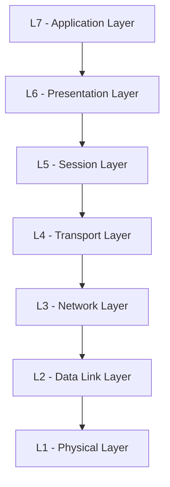
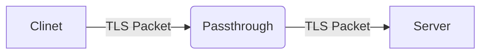
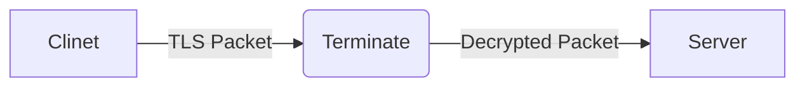
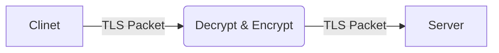
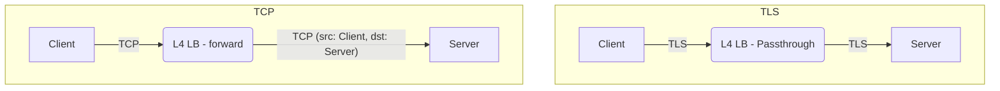
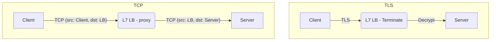

## 동기

이 글은 명확한 주제를 가지고 작성하는건 아니다. 

Web Server를 운영하는데 [K8S(Kubernetes)](https://kubernetes.io/)로, [ingress nginx controller](https://github.com/kubernetes/ingress-nginx)를 사용하고 있다.
하지만, 26년 3월까지 [maintenance 종료](https://kubernetes.io/blog/2025/11/11/ingress-nginx-retirement/)가 예정되어 있어 다음 방법으로 [Gateway API](https://gateway-api.sigs.k8s.io/)를 고민하고 있다.

Gateway API를 고민하며 평소에는 대소롭지 않게 여겼던 네트워크 지식을 몇 개 채우려고 정리한 글이다.

이 글을 보는 여러분들의 지식 욕구를 충족 시켜 줄지는 모르겠지만, 아래 문단의 "질문"이 궁금하다면 글을 계속 읽어보면 좋을지도 모른다.
전문적인 내용은 아니지만, 독자의 흥미를 유발하는 정도의 자극을 주었으면 좋겠다. 

## 질문

Q. LB(Load Balancer)를 사용하는데 L4 LB, L7 LB라는 용어가 자주보인다. 이 두가지의 차이가 뭘까?

Q. Gateway API에서는 HTTP 연결과 TCP 연결을 구분해서 사용한다. 이 차이가 구체적으로 뭘까?

Q. Gateway API의 [TLS 개념](https://gateway-api.sigs.k8s.io/guides/tls/)을 보게되면 TLS Mode "Passthrough", "Terminate" 같은 용어가 나온다.
이게 어떤 개념일까?


<!-- truncate -->
## Gateway API?
[Gateway API](https://kubernetes.io/docs/concepts/services-networking/gateway/)는 K8S에서 ingress를 대체 할 수 있는 새로운 개념으로 등장하였다.
 단일 파일로 모든 설정을 커버하는 Ingress와는 다르게 Role 기반으로 Gateway API 리소스를 나누기도 하고, HTTP 뿐 아니라 TCP, GRPC 등 여러 프로토콜을 지원하고, 
헤더 변경, 트래픽 분류, 트래픽 미러링 등 다양한 기능들을 제공해주기도 한다.

글을 쓰는 현재 1.4.0 까지 공식 릴리즈가 되어있다. 

| Version                                                             | Release Date |
|---------------------------------------------------------------------|--------------|
| [1.4.0](https://kubernetes.io/blog/2025/11/06/gateway-api-v1-4/)    | 2025.10.06   |
| [1.3.0](https://kubernetes.io/blog/2025/06/02/gateway-api-v1-3/)    | 2025.04.24   |


## L4? L7?

실제 서비스를 운영하면서 로드밸런싱이 필요하다. 그런데 LB(Load Balancer)를 선택하는데 L4 LB, L7 LB와 같은 선택지가 존재하게 된다.
이 두가지 차이는 어떻게 발생을 할까? 이를 알기 위해서는 한번쯤은 들어봤을 법한 [OSI 7 계층](https://en.wikipedia.org/wiki/OSI_model)이 등장한다.

### OSI 7 Layer



간략하게 짚고 넘어가면, 다음과 같다.
- L7 - Application: 사용자의 정보를 다루는 레이어(HTTP) 
- L6 - Presentation: L7에서 사용할 데이터를 준비하는 레이어
- L5 - Session: 통신의 수신과 송신을 연결하는 레이어
- L4 - Transport: 통신을 전달하는 레이어 (TCP)
- L3 - Network: 서로 다른 네트워크 간 전송을 담당하는 레이어
- L2 - Data Link: 같은 네트워크 간 전송을 담당하는 레이어
- L1 - Physical: 전기 신호가 실제로 이동하는 레이어

여기서 주로 하드웨어 장비와 가까운 L1, L2, L3는 제외하고, 경계와 구분이 애매모호한 L5, L6를 제외하고 우리가 집중 할 것은
L4와 L7이다.

- **L4 Transport**
   - 데이터를 전송하는 레이어.
   - TCP, UDP가 이쪽 계층.
   - TCP이기 때문에 어느정도 연결(세션)과 관련이 있다.
- **L7 Application**
   - 실제 데이터를 다루는 레이어.
   - HTTP 계층
   - 메세지(header, body)를 다룬다.

### 그래서, L4 LB? L7 LB?

LB에서 말하는 L4와 L7은 바로 OSI 7계층의 Layer를 의미한다.
L4 LB라는 것은 LB가 L4, Transport 역할을 수행하며 데이터의 전송만을 담당한다.
반대로 L7 LB는 LB가 L7, Application 역할을 수행할 수 있으며 데이터의 전송 뿐 아니라 내부 메세지도 파악 할 수 있다는 것을 의미한다.

LB가 어떤 역할을 하는지, 단순 메세지 전송만 담당하는지 (L4) 메세지에 따른 분석이 필요한지 (L7)에 따라 다르게 사용할 수 있다.

구체적인 LB의 동작도 L4, L7에 따라 각각 Forward와 Proxy로 나뉜다. 이는 TCP의 연결 방식에 관련이 있는데, 아래를 살펴보자.

Forward는 TCP 연결을 유지해서 서버까지 Client의 TCP를 유지해서 가져간다.
```shell
Client -- TCP --> LB(forward) -- TCP(src: client, dst: server) --> server
```

Proxy는 TCP 연결을 유지하지 않고, LB와 server 사이의 TCP를 다시 만들어서 요청을 중개한다.
```shell
Client -- TCP(src: client, dst: LB) --> LB(proxy) -- TCP(src: LB, dst: server) --> server
```

따라서 TCP가 Client가 직접 Server와 연결되는지(forward)와 LB와 연결되는지(Proxy)에 따라 동작이 달라진다.


L4, L7의 차이 그리고 Forward, Proxy의 차이는 다음과 같이 정리 할 수 있다. 

| 특징             | L4 LB   | L7 LB |
|----------------|---------|-------|
| 메세지 확인 유무      | ❌       | ✅     |
| 모드             | Forward | Proxy |
| Client의 TCP 연결 | Server  | LB    |
| Server의 응답 경로  | Client  | LB    |

특징들을 해석하면 다음과 같다.
- L7 LB는 메세지를 확인 할 수 있기 때문에 데이터에 따른 다양한 전략 (데이터에 따른 트래픽 분산, header 추가)을 사용 할 수 있다.
- L4 LB는 메세지 확인은 불가능하지만, server 응답을 LB에서 중개하지 않고 server는 client로 직접 요청을 보내기 때문에 성능상 이점을 볼 수 있다.  

이런 특징들을 본인의 애플리케이션에는 어떤 종류가 맞는지에 따라 결정 할 수 있다.

## TCP? HTTP?

TCP는 L4 - Transport Layer로 데이터 전송에 관심을 가진다. 
반면 HTTP는 L7 - Application Layer로 메세지, 데이터의 내용에 관심을 가지는 레이어이다.

TCP의 역할은 데이터를 전송하는 것이며, 데이터는 단일 데이터로 전송할 때 속도가 늦어지거나 안정성이 떨어지기 때문에
여러 패킷을 나누어 잘게 쪼개서 전달한다.
여러개로 나뉜 패킷들의 올바른 전송을 위해 패킷들의 순서 정렬, 에러 제어 등 역할을 한다.
또한, 3 way handshake로 연결을 수립하고 4 way close로 연결을 종료하는 등 연결 및 전송을 수행한다.

HTTP의 역할은 메세지이다. 데이터에 의미를 부여하고 해석하고 사용하기 때문에 Header, Body와 같은 규칙을 가지고 있다.
HTTP 1.1에서는 keep-alive로 HTTP 2에서는 multiplexing으로 통신의 고속화 및 연결의 유지 및 다중처리를 하지만, 이는 TCP 레벨에서
수립한 connection을 이용한다.

TCP의 연결 및 수립은 TCP의 역할이지만, 연결 타이밍 및 종료 타이밍은 L7 레벨, 즉 Application 계층에서 수행하기 때문에 HTTP에서 여러 
연결과 관련된 동작을 수행한다.

> The resulting protocol is more friendly to the network because fewer TCP connections can be
used in comparison to HTTP/1.x. - [HTTP/2 RFC](https://www.rfc-editor.org/rfc/rfc9113.pdf)

TCP와 HTTP의 역할에서도 L4와 L7의 차이가 드러난다.
L4는 데이터의 전송에 역할을 두기 때문에 TCP에 그런 역할이 녹아들었고, L7는 데이터의 사용에 역할을 두기 때문에 여러 의미 있는 정보들을 전달한다.

## TLS termination?
Gateway API는 [TLS](https://gateway-api.sigs.k8s.io/guides/tls/) 내용도 가이드 하고 있다.
해당 문서에서의 의도는 Gateway가 Client와 Server 사이에서 트래픽을 중개하는 여러가지 시나리오가 있고, 
그 시나리오에 따라 TLS를 복호화하고 암호화하는 경우가 달라진다.

예를 들어서 아래와 같이 Client가 암호화 된 TLS 패킷을 Gateway에서 전달 했을 때, 복호화를 하지 않는다면 내부 path나 header를 볼 수 없다.

이런 모드를 TLS Passthrough라고 한다. TLS 요청을 복호화 하지 않고 Server로 그대로 전달하기 때문에 Gateway는 Request의 정보를 볼 수 없다.

만약, 아래와 같이 Gateway에서 Server로 복호화 된 데이터를 전달한다면 어떻게 될까? 

Gateway가 TLS 복호화를 진행하고, Gateway는 복호화 된 데이터를 열람 할 수 있다. 이로써 Request의 path, header와 같은 정보를 보고
Server로의 경로를 바꾸거나, 여러가지 로직을 넣을 수 있게 된다. 
복호화 된 데이터는 그대로 Server로 전달하게 되어 Server에서도 복호화 된 데이터를 그대로 받는다.
이러한 방식이 TLS terminate 입니다. 중간 Gateway에서 TLS를 종료시켜서 Gateway도 메세지를 사용하고, Server도 메세지를 그대로 사용할 수 있다.  

Gateway가 메세지를 확인해야하는데, Gateway와 Server와의 통신도 암호화를 해야한다면 어떤 구조가 가능할까?

위와 같이 Gateway에서 Decrypt를 진행하여 TLS Request 정보를 확인하고, Server로 보내기 전 TLS Encrypt를 다시 진행하는 것이다.
그렇게 되면 Gateway는 메세지를 확인 할 수 있으면서, Server로 암호화 된 데이터를 보낼 수 있다. 단, Request를 다시 암호화 하기 위해 
Gateway는 TLS 인증서를 가지고 있어야 할 것이다.


## Conclusion
이 글에서 OSI 7계층 중 L4 - Transport 계층, L7 - Application 계층을 알아보았고, TCP와 HTTP도 간략하게 알아보았다.
또한, L4 LB / L7 LB의 forward 모드와 proxy 모드, TLS termination과 관련 된 내용도 확인했다.

각각의 개념을 따로 보았지만, 이는 한가지로 연결되는 개념일 수 있다.

시나리오를 가정하여, Client의 요청이 LB에서 메세지의 분석 없이 Server로의 전달만 목표로 한다면 어떤 아키텍쳐를 사용하는게 좋을까?

메세지의 분석이 필요 없다면 LB는 L4 Layer 역할만 하면되므로 L4 LB를 선택할 가능성이 높습니다. 그렇다면 자연스럽게 L4 LB forward 모드를 사용하여 
Server에서는 응답을 Client로 직접 내려준다.

TLS는 어떻게 될까요? TLS를 확인할 필요가 없으므로 LB에서는 Passthrough를 선택할 수도 있고, 인증서 관리를 Server가 아닌 LB로 위임하기 위해 
TLS Terminate 전략을 사용할 수도 있다.

전략을 정리하면 아래와 같다.
- L4 LB 사용
  - forward 모드
  - TCP는 Client와 Server가 직접 연결하게 됨.
  - Server는 응답을 LB를 거치지 않고 Client로 바로 전달함.
- TLS Passthrough 사용
  - LB에서 요청의 메세지를 확인 할 필요가 없으므로 TLS와 무관하게 데이터를 전달한다.



만약 LB에서 메세지를 보고 path 별, Request header별 데이터를 분기해서 전달하는 조건이라면 어떻게 될까?
LB에서 메세지를 보고 분기를 해야하므로 L7 LB를 사용해야한다. 그러면 LB는 Proxy 모드로 LB는 Client와 Server와 각각 TCP 연결을 수립한다.
TLS는 어떻게 될까요? 암호화 된 정보를 확인할 수는 없으므로 LB에서 복호화를 해야하고, 이후 Server로 
암호화 된 요청이 가야하는지에 따라 TLS Termination으로 일반 패킷을 보낼지, TLS Re-encrypt를 통해 다시 패킷을 암호화할지 결정한다.

- L7 LB 사용
  - proxy 모드
  - TCP는 LB에서 Client와 Server에 각각 연결하게 됨.
  - Server는 응답을 LB를 거쳐 LB가 Client로 응답을 전달함.
- TLS Terminate 사용
  - LB에서 요청의 메세지를 확인해야하므로 TLS를 복호화해서 확인하고, Server로 일반 패킷을 전달한다.




## Reference
- [L4 Layer LB and L7 Layer LB](https://www.a10networks.com/glossary/how-do-layer-4-and-layer-7-load-balancing-differ)
