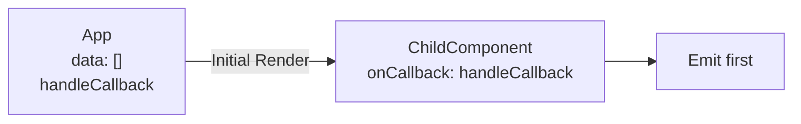
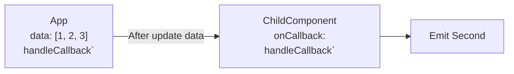
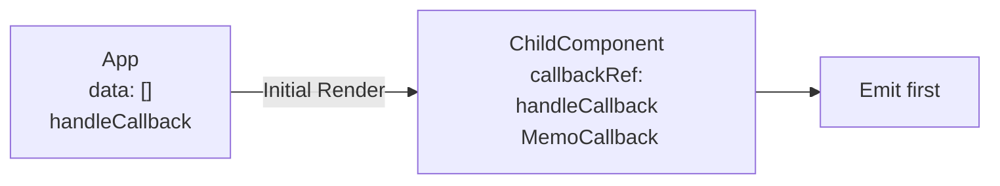
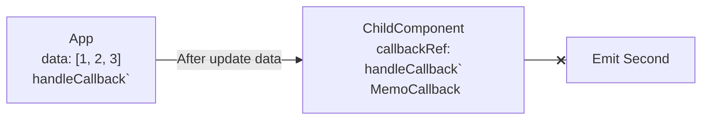

import { Playground } from '@site/src/components/playground/index.tsx'
import { basicProblemSnippet, basicProblemSolveSnippet, listProblemSnippet, useCallbackRefSnippet, edgeCaseSnippet } from '@site/src/code-snippet/useCallbackRef/index.js'

In React, when passing a function as component props, one needs to be careful with managing references
to avoid unnecessary re-renders.
Although most case we use `useCallback` to prevent unnecessary re-renders, I found an alternative solution sharing.

The code that inspired this article is [radix-ui/primitives](https://github.com/radix-ui/primitives)'s [useCallbackRef](https://github.com/radix-ui/primitives/blob/main/packages/react/use-callback-ref/src/useCallbackRef.tsx).
This article will discuss the use cases and logic of `useCallbackRef`.

Below is the `useCallbackRef` code we are going to discuss.
Can you guess in what situations it might be used?
```tsx
// useCallbackRef.js
import { useRef, useEffect, useMemo } from 'react';

export function useCallbackRef(callback) {
  const callbackRef = useRef(callback);

  useEffect(() => {
    callbackRef.current = callback;
  });

  return useMemo(() => ((...args) => callbackRef.current?.(...args)), []);
}
```
<!--truncate-->

## Problem Description

First, let's introduce a case where a problem occurs due to function props.
This is a simple example where the reference of a function changes due to a state change,
affecting the children as well.

<Playground title="Basic Problem" files={basicProblemSnippet} defaultOutput="console" />

The problem in the above code is that `handleCallback` is called twice.

The purpose of the example code is to update the data after 2 seconds using `useAsyncData`,
and separately, to pass the `handleCallback` function to the `ChildComponent` to call it once at the mount.

The detailed flow is as follows.

In the first render, the data is empty, and `handleCallback` is passed to the child and called once.


After the data is updated, App.js creates a new `handleCallback` and passes it to ChildComponents,
So `handleCallback` is called for the second time.

### Solution?
Of course, in the above example, if you use `useCallback` to memoize `handleCallback` regardless of the data update,
the problem can be solved.


<Playground title="Basic Problem with useCallback" files={basicProblemSolveSnippet} defaultOutput="console" />

We could conclude the article with the lesson that when passing function props,
you need to be mindful of memoization. But what about the next example?

<Playground title="List Problem" files={listProblemSnippet} defaultOutput="console" />

```tsx
const handleCallback = useCallback((index) => {
  console.log(`handle callback: ${index}`);
}, []);

...
{list.map((item, index) => (
  // highlight-next-line
  <ChildComponent key={index} onCallback={() => handleCallback(index)} />
))}
```

In this example, unlike the previous one, the callback functionis injected as props of a component that iterates over a list,
and it receives the index data, which can only be known when iterating over items, as params.

Under these case, even if `handleCallback` is memoized with useCallback, it is unintentionally called multiple times due to the anonymous function created during rendering.

There is also a solution for this. If you pass the index as props and call `onCallback` and index inside `ChildComponent`
instead of using an anonymous function, this problem is solved. However, in actual situations, `ChildComponent` may be a component
that can't be controlled (like external library) or a common component with a wide range of influence, making problem solving more complex.

:::note
There is also a mehtod that modifies the dependency of useEffect in `ChildComponnet`
without using the various methods suggested above.

```tsx
const ChildComponent = ({ onCallback }) => {
  useEffect(() => {
    onCallback();
  // highlight-next-line
  }, []);

  return <>Child</>;
};
```

In this case, duplicate calls can be resolved and it may be fine to use this method by some case.
However, it violates the React hook related lint rule [react-hooks/exhaustive-deps](https://legacy.reactjs.org/docs/hooks-rules.html#eslint-plugin) and
can make debugging difficult, so it is not considered in this article.
```
ESLint: React Hook useEffect has a missing dependency:
'onCallback'. Either include it or remove the dependency array.
If 'onCallback' changes too often, find the parent component that defines it and wrap that definition in useCallback.
(react-hooks/exhaustive-deps)
```

:::

## useCallbackRef

Let's use `useCallbackRef`. I applied `useCallbackRef` directly to this list example we just saw.

<Playground title="Use Callback Ref" files={useCallbackRefSnippet} defaultOutput="console" />

Based on the results, unnecessary `handleCallback` calls do not seem to be found. Did I modify the example code a lot?

```tsx showLineNumbers
// App.js
const ChildComponent = ({ onCallback }) => {
  // highlight-start
  const handleCallback = useCallbackRef(onCallback);
  // highlight-end

  useEffect(() => {
  // highlight-start
    handleCallback();
  }, [handleCallback]);
  // highlight-end

  return <>Child</>;
};
```
There are no changes in App.js, and there are changes in the internal logic of `ChildComponent` using `onCallback`.
`ChildComponent` uses `handleCallback` which wraps the `onCallback` received as props using `useCallbackRef`,
and also uses `handleCallback` as  a dependency of useEffect.

So what's inside `useCallbackRef`?

```tsx showLineNumbers
// useCallbackRef.js
import { useRef, useEffect, useMemo } from 'react';

export function useCallbackRef(callback) {
  const callbackRef = useRef(callback);

  useEffect(() => {
    callbackRef.current = callback;
  });

  return useMemo(() =>
    (...args) => callbackRef.current?.(...args),
  []);
}
```

`useCallbackRef` provides two functions.
1. It continuously updates the `ref` by receiving the callback function as params.

If you look closely, `callbackRef` is updated every time the callback is updated without dependency at `L7-L9`.

2. It returns function that calls the callback stored in callbackRef.

Here, it uses `useMemo` to prevent the return value from being updated and calls the value of `callbackRef`
when the return value is called, so it call always call the latest callback.

The detailed flow is as follows.

The initial flow is similar to the previous one.
App passes `handleCallback` to `ChildComponent`, `ChildComponent` stores `handleCallback` in `callbackRef`
and uses `MemoCallback`. The function called at `Emit First` is `MemoCallback`,
and since `MemoCallback` points to `handleCallback`, we can see that the function actually called is `handleCallback`.


The second flow is changed. When the data is updated and handleCallback is newly created as ``handleCallback` `` and passes to `ChildComponnet`,
`callbackRef` updates it, but `MemoCallback` used inside the component does not change its reference, so the second call does not occur.

This method can be useful when designing components, especially because it allows internal optimization without imposing a rule
that memoization must be done externally.

## Potential Issues
`useCallbackRef` cannot be the solution to everything. In the examples above, if `handleCallback` needs to be called the second time, not the first time,
the second call does not occur, so it may not work as intended.

The following example is code intended to call `handleCallback` with data information.

<Playground title="Edge Case" files={edgeCaseSnippet} defaultOutput="console" />

In the example, it seems that `handleCallback` is not being called properly due to `useCallbackRef`.

```tsx
// handleCallback
const data = useAsyncData();

const handleCallback = useCallback(() => {
  // highlight-start
  if (data.length !== 0) {
    console.log(`handle callback: ${data}`);
  }
  // highlight-end
}, [data]);
```
Since it operates on the premise that `data` exists (`data.length !== 0`),
it can be seen that the correct purpose is rater to induce duplicate calls.

## Conclusion

In React, we introduced the operation of a custom hook called `useCallbackRef` as a solution other than orthodox
methods like `useCallback` for issues that can occur due to re-rendering when passing a function as props.

`useCallbackRef` always preserves the most recent props function in the `ref` by storing the function received as props in the `ref` each time.
However, since the return value is exposed wrapped in useMemo, re-rendering due to props changes does not occur.

Through this, it is possible to prevent calls due to unintentional re-rendering while obtaining the most recent callback function
at the time of callback function call.

However, if there are cases where the call is delayed or called multiple times depending on the dependency,
this logic could rather be a poison, so you should make a good judgment according to the case.
