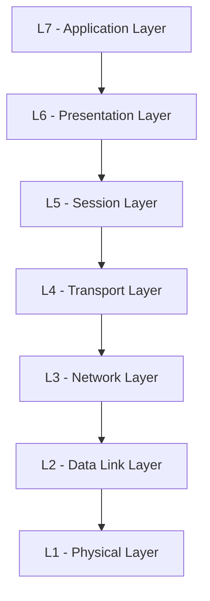
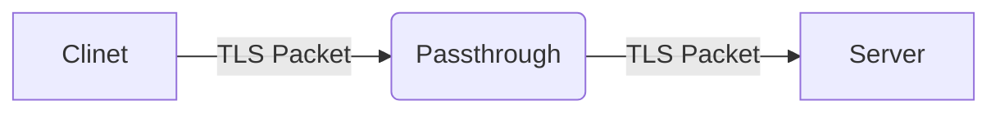
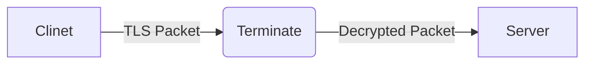
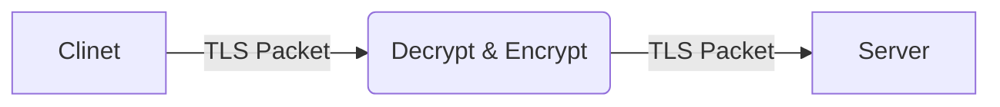
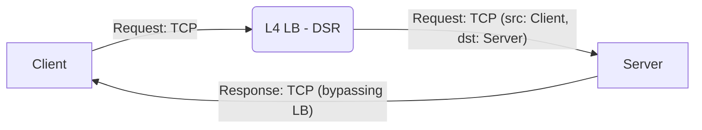
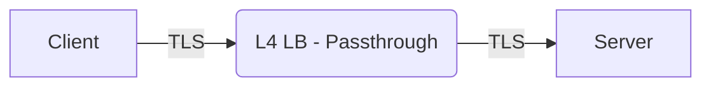
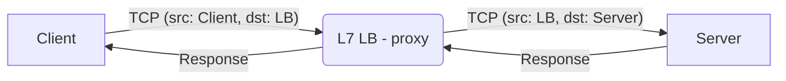
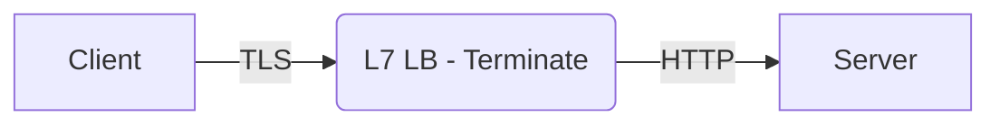

## Motivation

This post doesn't have a single clear topic.

I'm currently running a web server using [K8S(Kubernetes)](https://kubernetes.io/) with the [ingress nginx controller](https://github.com/kubernetes/ingress-nginx).
However, since maintenance is scheduled to [end in March 2026](https://kubernetes.io/blog/2025/11/11/ingress-nginx-retirement/), I'm considering [Gateway API](https://gateway-api.sigs.k8s.io/) as the next solution.

This is a collection of networking knowledge that I previously overlooked while considering Gateway API.

I'm not sure if this will satisfy your knowledge curiosity, but if you're curious about the "questions" in the section below, it might be worth reading on.
While not expert-level content, I hope it provides enough stimulation to pique your interest.

## Questions

Q. I often see terms like L4 LB and L7 LB when working with Load Balancers. What's the difference between these two?

Q. Gateway API distinguishes between HTTP connections and TCP connections. What exactly is the difference?

Q. When looking at the [TLS concepts](https://gateway-api.sigs.k8s.io/guides/tls/) in Gateway API, terms like TLS Mode "Passthrough" and "Terminate" appear.
What do these concepts mean?


<!-- truncate -->
## Gateway API?
[Gateway API](https://kubernetes.io/docs/concepts/services-networking/gateway/) has emerged as a new concept that can replace Ingress in K8S.
Unlike Ingress, which covers all settings in a single file, Gateway API divides resources based on roles, supports various protocols beyond HTTP such as TCP and GRPC, and provides various features like header modification, traffic classification, and traffic mirroring.

Currently, version 1.4.0 has been officially released as of this writing.

| Version                                                             | Release Date |
|---------------------------------------------------------------------|--------------|
| [1.4.0](https://kubernetes.io/blog/2025/11/06/gateway-api-v1-4/)    | 10/06/2025   |
| [1.3.0](https://kubernetes.io/blog/2025/06/02/gateway-api-v1-3/)    | 04/24/2025   |


## L4? L7?

Load balancing is necessary when operating actual services. However, when choosing a Load Balancer (LB), you encounter options like L4 LB and L7 LB.
How do these differences arise? To understand this, we need to look at the [OSI 7 Layer model](https://en.wikipedia.org/wiki/OSI_model) that you've probably heard of at least once.

### OSI 7 Layer



Briefly summarized, it's as follows:
- L7 - Application: Layer that handles user information (HTTP)
- L6 - Presentation: Layer that prepares data for L7
- L5 - Session: Layer that connects communication transmission and reception
- L4 - Transport: Layer that handles communication delivery (TCP)
- L3 - Network: Layer responsible for transmission between different networks
- L2 - Data Link: Layer responsible for transmission within the same network
- L1 - Physical: Layer where electrical signals actually move

Here, excluding L1, L2, L3 which are close to hardware equipment, and excluding L5, L6 where boundaries are ambiguous, what we'll focus on is L4 and L7.

- **L4 Transport**
   - Layer for transmitting data
   - TCP and UDP belong to this layer
   - TCP is a connection-oriented protocol that establishes connections through 3-way handshake and maintains state
- **L7 Application**
   - Layer that handles actual data
   - HTTP layer
   - Handles messages (header, body)

### So, L4 LB? L7 LB?

L4 and L7 in LB refer to the layers in the OSI 7 Layer model.
**L4 LB** only checks IP address and Port information (Transport Layer) to distribute traffic.
Conversely, **L7 LB** can analyze application layer information such as HTTP headers, URL paths, and cookies, enabling more granular traffic control.

L4 and L7 can be distinguished by which layer of information the LB analyzes.

### LB Operation Modes

LB operation modes are a separate concept, divided into **DSR (Direct Server Return)** and **Proxy/NAT** modes.

**DSR (Direct Server Return) mode** - requests go through the LB, but responses are sent directly from the server to the client.
```shell
# Request
Client -- TCP --> LB(DSR) -- TCP(src: client, dst: server) --> Server

# Response
Response: Server -- TCP(src: server, dst: client) --> Client (bypassing LB)
```

**Proxy/NAT mode** - LB mediates all traffic between client and server.
```shell
# Request
Client -- TCP(src: client, dst: LB) --> LB(Proxy) -- TCP(src: LB, dst: server) --> Server

# Response
Server -- TCP(src: server, dst: LB) --> LB(Proxy) -- TCP(src: LB, dst: client) --> Client
```

Generally, L4 LB often uses DSR mode, while L7 LB uses Proxy mode.
L7 LB must operate in Proxy mode because it needs to analyze HTTP messages,
while L4 LB can use both modes but prefers DSR mode for performance benefits.


The differences between L4 and L7 and their main operation modes can be summarized as follows:

| Feature                  | L4 LB                    | L7 LB |
|---------------------|--------------------------|-------|
| Analysis Layer               | IP, Port (Transport)     | HTTP headers, path (Application) |
| Application Message Inspection      | ❌                        | ✅     |
| Commonly Used Mode          | DSR or Proxy/NAT        | Proxy |
| Response Path in DSR Mode     | Server → Client direct      | Not available |
| TCP Connection in Proxy Mode   | Client-LB, LB-Server     | Client-LB, LB-Server |

Interpreting these features:
- **L7 LB** can inspect HTTP messages, enabling various strategies such as URL path-based routing, header-based branching, and cookie-based session persistence.
- **L4 LB (DSR mode)** cannot inspect messages, but has performance advantages as response traffic bypasses the LB and goes directly from server to client, significantly reducing the LB's network load. This effect is significant because response data is typically much larger than requests.

You can decide which type suits your application based on these characteristics.

## TCP? HTTP?

TCP is the L4 - Transport Layer that focuses on data transmission.
In contrast, HTTP is the L7 - Application Layer that focuses on the content of messages and data.

TCP's role is to transmit data. Since transmitting data all at once can be slow or unreliable,
it divides and transmits data into smaller packets.
It handles packet ordering, error control, etc., for proper transmission of the divided packets.
It also performs connection establishment through 3-way handshake and connection termination through 4-way close.

HTTP's role is messaging. It has rules like Header and Body because it gives meaning to data, interprets it, and uses it.

**HTTP is a protocol that operates on top of TCP.**
- TCP: Connection establishment and guaranteed data transmission
- HTTP: Message format and semantics definition on top of TCP connections

HTTP 1.1's keep-alive and HTTP 2's multiplexing are technologies that reuse a single TCP connection to handle multiple HTTP requests.
TCP itself manages the connection, but HTTP (Application layer) decides when to maintain and terminate connections.

> The resulting protocol is more friendly to the network because fewer TCP connections can be
used in comparison to HTTP/1.x. - [HTTP/2 RFC](https://www.rfc-editor.org/rfc/rfc9113.pdf)

The roles of TCP and HTTP also reveal the difference between L4 and L7.
L4 focuses on data transmission, which is why TCP incorporates such roles, while L7 focuses on data usage, conveying various meaningful information.

## TLS termination?
Gateway API also provides guidance on [TLS](https://gateway-api.sigs.k8s.io/guides/tls/).
The intent of this documentation is that there are various scenarios where the Gateway mediates traffic between Client and Server, and depending on the scenario, TLS encryption and decryption cases differ.

For example, as shown below, when a Client sends an encrypted TLS packet to the Gateway, if it's not decrypted, internal paths or headers cannot be viewed.

This mode is called TLS Passthrough. The Gateway cannot see the Request information because TLS requests are forwarded to the Server without decryption.

What if the Gateway forwards decrypted data to the Server as shown below?

The Gateway decrypts TLS and can view the decrypted data. This allows it to view Request information like path and headers, change the route to the Server, or add various logic.
The decrypted data is forwarded to the Server as is, and the Server also receives the decrypted data.
This approach is TLS terminate. By terminating TLS at the intermediate Gateway, both the Gateway and Server can use the messages.

What if the Gateway needs to inspect messages but communication between Gateway and Server also needs to be encrypted?

As shown above, the Gateway decrypts to inspect the TLS Request information, then re-encrypts before sending to the Server.
This way, the Gateway can inspect messages while sending encrypted data to the Server. However, to re-encrypt the Request, the Gateway must possess a TLS certificate.


## Conclusion
In this post, we explored L4 - Transport layer and L7 - Application layer among the OSI 7 layers, and briefly looked at TCP and HTTP.
We also examined L4 LB / L7 LB's DSR mode and Proxy mode, as well as TLS termination-related content.

While we looked at each concept separately, they can be connected as a single concept.

Let's assume a scenario: if the goal is only to forward Client requests to the Server without message analysis at the LB, what architecture would be good?

If message analysis is not needed, the LB only needs to play an L4 Layer role, so L4 LB is likely to be chosen. Then naturally, L4 LB DSR mode would be used, and the Server would send responses directly to the Client.

What about TLS? Since there's no need to inspect TLS, the LB could choose Passthrough, or use TLS Terminate strategy to delegate certificate management to the LB instead of the Server.

The strategy can be summarized as follows:
- Using L4 LB
  - DSR mode
  - Request: Client → LB → Server (maintaining TCP information)
  - Response: Server → Client direct (bypassing LB)
- Using TLS Passthrough
  - Since the LB doesn't need to inspect request messages, it forwards data regardless of TLS

- TCP


- TLS

<br/>
What if the LB needs to view messages and branch data by path and Request headers?
The LB needs to view messages and branch, so L7 LB must be used. Then the LB operates in Proxy mode, establishing separate TCP connections with Client and Server.
What about TLS? Since encrypted information cannot be inspected, the LB must decrypt it, and then decide whether to send regular packets with TLS Termination or re-encrypt packets with TLS Re-encrypt to the Server depending on whether encrypted requests need to go to the Server.

- Using L7 LB
  - proxy mode
  - TCP connects separately between LB and Client/Server
  - Server sends responses through LB, which forwards them to Client
- Using TLS Terminate
  - Since the LB needs to inspect request messages, it decrypts TLS to inspect and forwards regular packets to the Server

- TCP


- TLS



## Reference
- [L4 Layer LB and L7 Layer LB](https://www.a10networks.com/glossary/how-do-layer-4-and-layer-7-load-balancing-differ)
